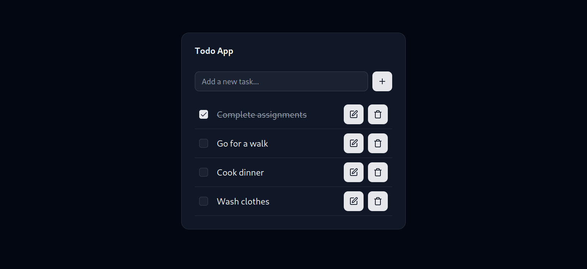

# React.js Todo App

This is a simple todo app built with React.js. It is a good starting point for beginners who want to learn React.js.



## Features

- Add a new todo
- Mark a todo as completed
- Delete a todo
- Edit a todo

## Installation

1. Clone the repository

```bash
git clone https://github.com/saadfrhan/todo-app-reactjs.git
```

2. Install dependencies

```bash
pnpm install
```

3. Run the app

```bash
pnpm dev
```

4. Open `http://localhost:5173` in your browser.

## Things used in this project

- React.js
- TypeScript
- Zustand
- Shadcn UI
- Tailwind CSS

## License

This project is open source and available under the [MIT License](LICENSE).
